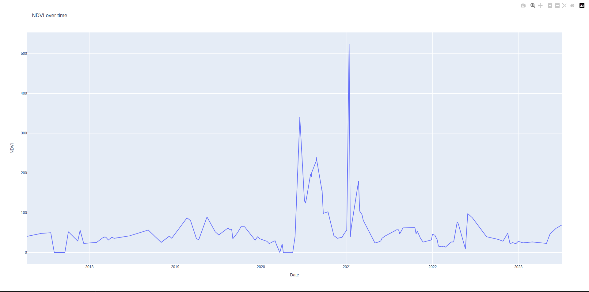

# NDVI Time-Series Analyzer

The NDVI Time-Series Analyzer is a Python script that calculates and visualizes the Normalized Difference Vegetation Index (NDVI) for given geospatial points over a specified time range using Sentinel-2 L2A imagery.

## Dependencies
- os
- numpy
- pandas
- geopandas
- plotly.express
- scipy
- datetime
- satsearch
- shapely
- rio_tiler
- loguru
- joblib

## Setup

1. Ensure you have all the dependencies installed.
2. Clone/download the repository.

## How to Use

1. Prepare a GeoJSON file named `points.geojson` in the root directory. This should contain the geospatial points you want to analyze.
2. Adjust the `start_year` and `end_year` variables at the end of the script to set your desired date range.
3. Run the script.

## Features

- **get_pixel_value(urls, lon, lat, datetime)**:
  Retrieves the pixel value for specified bands at the given coordinates.
  
- **process_period(id, start_year, end_year, geometry)**:
  Processes a specified date range for a given point, fetching and analyzing satellite data.

- **plot_ndvi(df)**:
  Calculates, smoothes, and visualizes the NDVI values over time.

- **execute(start_year, end_year, geojson_file)**:
  Main execution function that reads in the GeoJSON data and triggers the data processing and visualization.

## Constants Configuration

- `STAC_API_URL`: URL for the STAC API.
- `COLLECTION`: Name of the satellite data collection.
- `CLOUD_COVER_LIMIT`: Maximum acceptable cloud cover percentage for satellite data.

## Notes

- This script currently only supports points in the GeoJSON file.
- Ensure that the `points.geojson` file has a column named 'ID'.
- Data fetching and processing may take some time depending on the date range and number of points.

